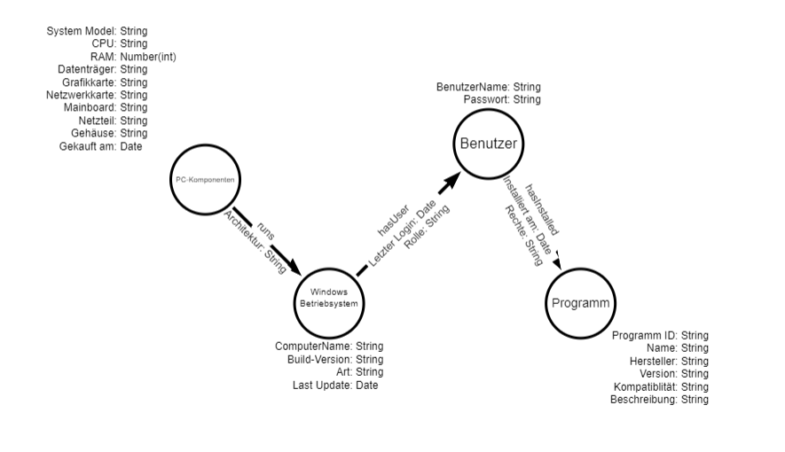

#### Block1-KN01

#### A:

Neo4j runtergeladen

#### B:

Ausgehend von der Hauptentität trainingSession habe ich die entsprechenden Kategorien definiert.
Alle Knoten repräsentieren dabei Entitäten, die in MongoDB als Collections umgesetzt werden.
Die Pfeile müssen nun nicht mehr über die Instanz benannt werden, sondern kommen direkt in den Pfeil hinein.
Dort drin wird dann auch alles Spezifisches dazu geführt. 

