#### Block2-KN02
## Add Data

CREATE
(pc:PC_Komponenten {
elementid: randomUUID(),
`System Model`: "Dell XPS 15",
CPU: "Intel Core i7",
RAM: 16,
Datenträger: "512GB SSD",
Grafikkarte: "NVIDIA GTX 1650",
Netzwerkkarte: "Intel Wi-Fi",
Mainboard: "ASUS Prime",
Netzteil: "Corsair 650W",
Gehäuse: "NZXT H510",
`Gekauft am`: date('2022-10-01')
}),
(wb:Windows_Betriebssystem {
elementid: randomUUID(),
ComputerName: "Workstation01",
`Build-Version`: "10.0.19042",
Art: "Pro",
`Last Update`: date('2023-05-01')
}),
(b:Benutzer {
elementid: randomUUID(),
BenutzerName: "Max Mustermann",
Passwort: "geheim"
}),
(p:Programm {
elementid: randomUUID(),
`Programm ID`: "P123",
Name: "Office Suite",
Hersteller: "Microsoft",
Version: "2021",
Kompatiblität: "Windows",
Beschreibung: "Office Productivity Suite"
}),
(pc)-[:runs {Architektur: "x64"}]->(wb),
(wb)-[:hasUser {`Letzter Login`: date('2023-06-15'), Rolle: "Admin"}]->(b),
(b)-[:hasInstalled {`Installiert am`: date('2023-06-20'), Rechte: "Standard"}]->(p);

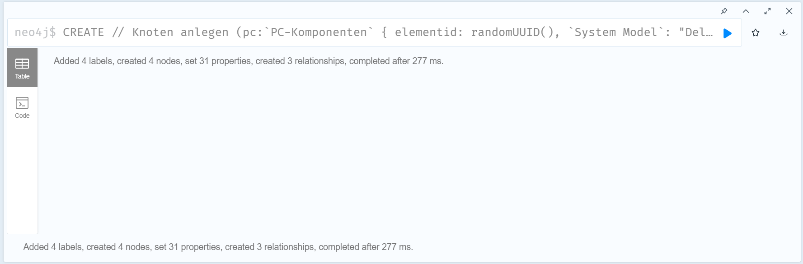

## Request Data:

Abrufen aller Knoten und Kanten:
MATCH (n)
OPTIONAL MATCH (n)-[r]->(m)
RETURN n, r, m;

-> MATCH: Sucht und gibt alle Knoten in der Datenbank zurück.
-> OPTIONAL MATCH: Sucht nach ausgehenden Beziehungen von jedem Knoten
Optional heisst hier, dass auch null werte mitberücksichtigt werden.

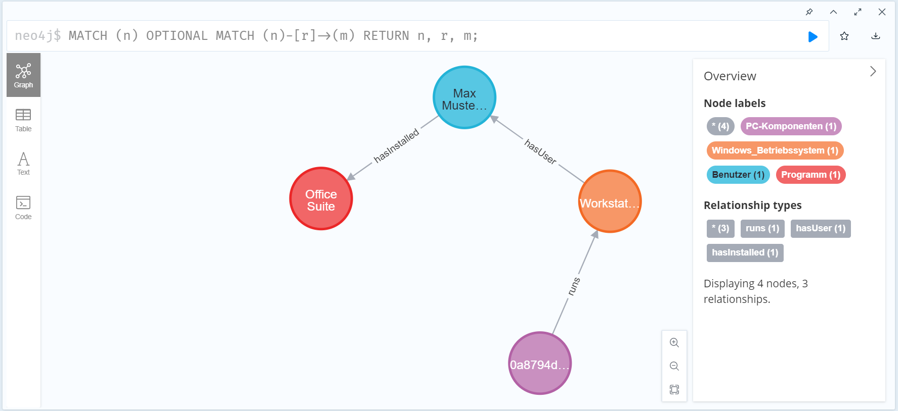

Die 4 szenarien:

Alle PC_Komponenten und Windows_Betriebssystem abrufen:
MATCH (pc:PC_Komponenten)-[r:runs]->(wb:Windows_Betriebssystem)
RETURN pc, r, wb;
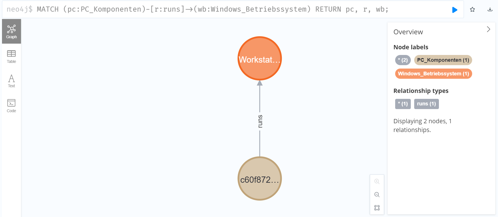

Benutzer mit installiertem Programm filtern:
MATCH (wb:Windows_Betriebssystem)-[r:hasUser]->(b:Benutzer)-[r2:hasInstalled]->(p:Programm)
WHERE r["Letzter Login"] > date('2023-06-01')
RETURN b.BenutzerName AS Name, r["Letzter Login"] AS LetzterLogin, p.Name AS InstalliertesProgramm;
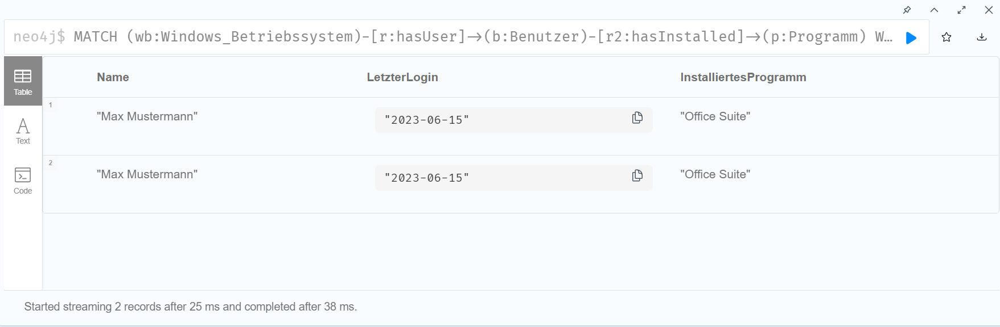

PC-Komponenten nach Kaufdatum filtern:
MATCH (pc:PC_Komponenten)
WHERE pc["Gekauft am"] > date('2022-01-01')
RETURN pc.`System Model` AS Modell, pc.`Gekauft am` AS Kaufdatum;
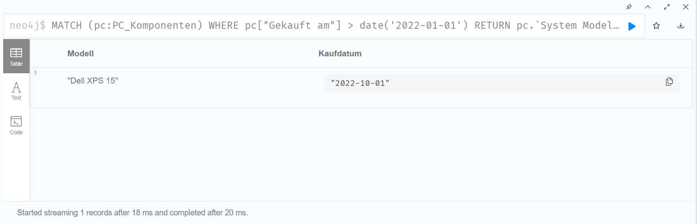

Vollständige Übersicht aller Knoten, auch ohne Beziehungen:
MATCH (n)
OPTIONAL MATCH (n)-[r]->(m)
RETURN n, r, m;
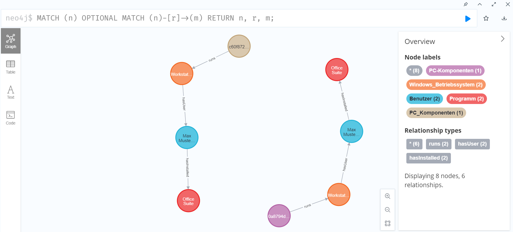

## Delete Data:

Ohne Detach:
MATCH (b:Benutzer {BenutzerName: "Max Mustermann"})
DELETE b;
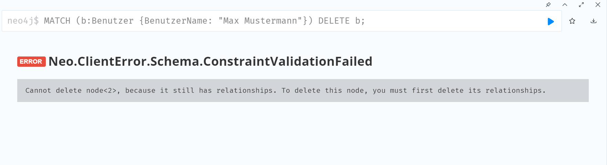

Mit Detach:
MATCH (b:Benutzer {BenutzerName: "Max Mustermann"})
DETACH DELETE b;
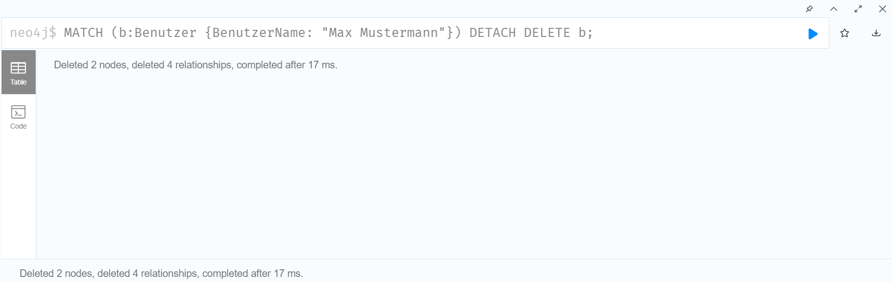

Bei Ohne Detach dürfen keine Beziehungen mehr da sein, sonnst kann ein fehler entstehen.

## Change Data:

Nach einer Systemaktualisierung soll der Wert des Feldes "Last Update" beim Windows‑Betriebssystem aktualisiert werden.

MATCH (wb:Windows_Betriebssystem {ComputerName: "Workstation01"})
SET wb["Last Update"] = date('2023-10-01')
RETURN wb;
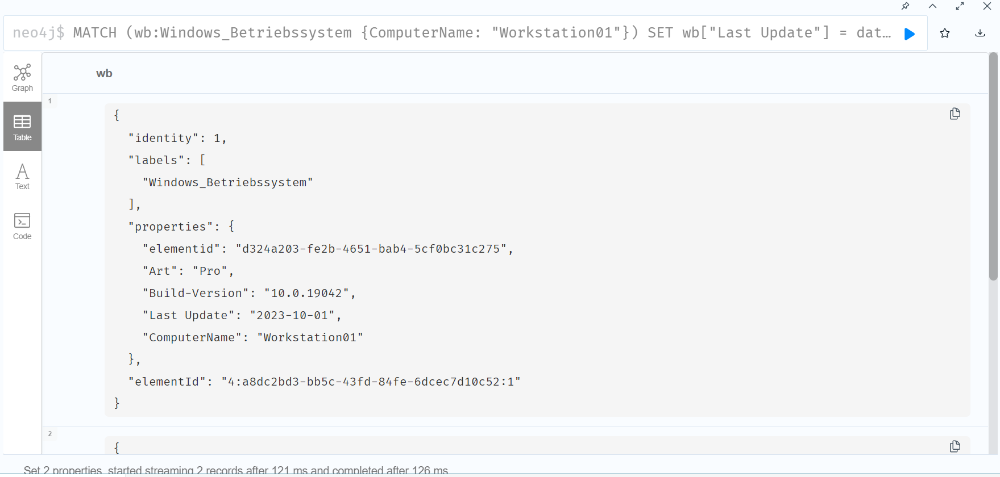

Ein Upgrade der Hardware erfolgt: Der RAM-Wert der PC-Komponenten soll von 16 GB auf 32 GB angepasst werden.
MATCH (pc:PC_Komponenten { `System Model`: "Dell XPS 15" })
SET pc.RAM = 32
RETURN pc;
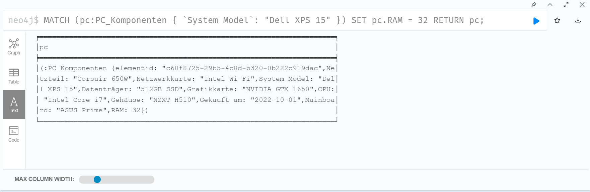

Nach einem Update von Office, muss die Programm-Version von "2021" auf "2022" geändert werden.
MATCH (p:Programm { `Programm ID`: "P123" })
SET p.Version = "2022"
RETURN p;
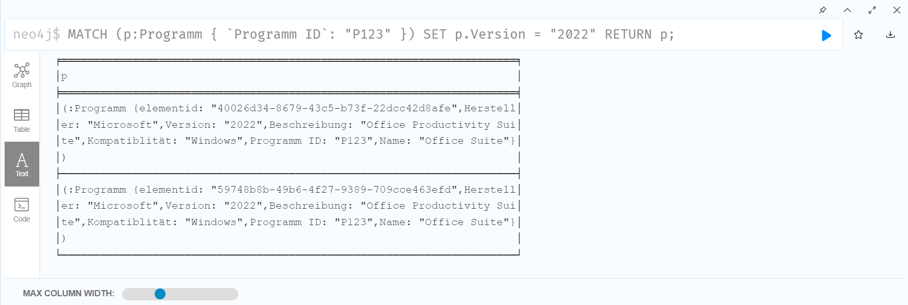

## Additional clauses

Angenommen, ein PC-Komponenten-Knoten enthält eine Liste von Anschlussmöglichkeiten.
Mit UNWIND sollen diese Einträge in einzelne Zeilen aufgespalten werden,
um für jeden Anschluss jeweils einen Port-Knoten zu erzeugen und diesen mit dem PC zu verknüpfen.

MATCH (pc:PC_Komponenten { `System Model`: "Dell XPS 15" })
SET pc.ports = ["USB", "HDMI", "Ethernet"]
WITH pc
UNWIND pc.ports AS port
MERGE (p:Port {name: port})
MERGE (pc)-[:HAS_PORT]->(p)
RETURN pc, collect(p.name) AS Ports;
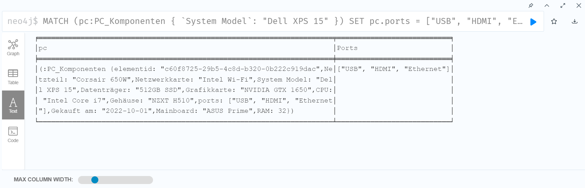

UNWIND "pc.ports AS port" teilt die Liste in einzelne Zeilen auf, dass für jeden Port Daten erzeugt werden.

Mit MERGE wird dafür gesorgt, dass für jeden Port Knoten keine Duplikate entstehen.

PC-Komponenten bzw. der RAM Wert soll mithilfe des CASE-Ausdrucks eine Kategorie bekommen.
z.b wird ein System als "High Performance" eingestuft, wenn der RAM 32 GB oder mehr beträgt,
andernfalls als "Standard" oder "Einsteiger".
MATCH (pc:PC_Komponenten)
RETURN pc.`System Model` AS System,
CASE
WHEN pc.RAM >= 32 THEN "High Performance"
WHEN pc.RAM >= 16 THEN "Standard"
ELSE "Einsteiger"
END AS Performance;
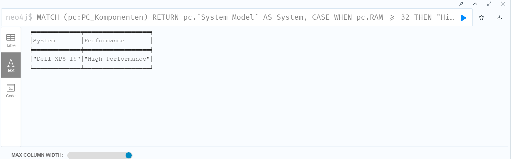
