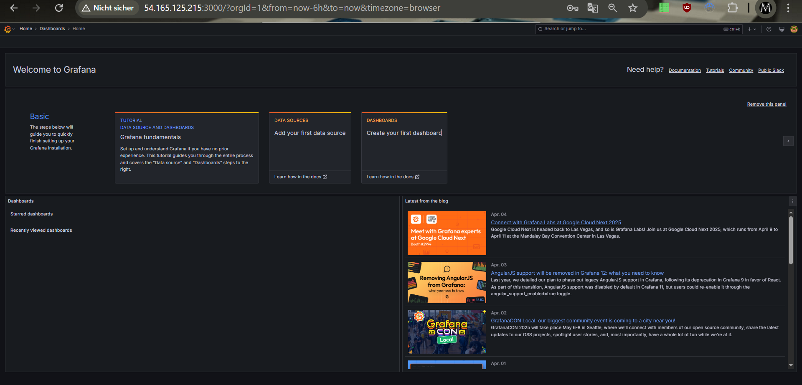
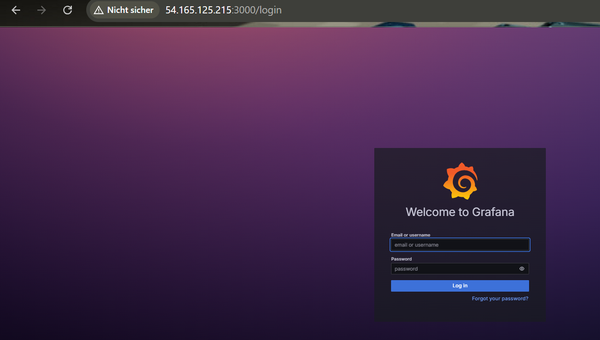
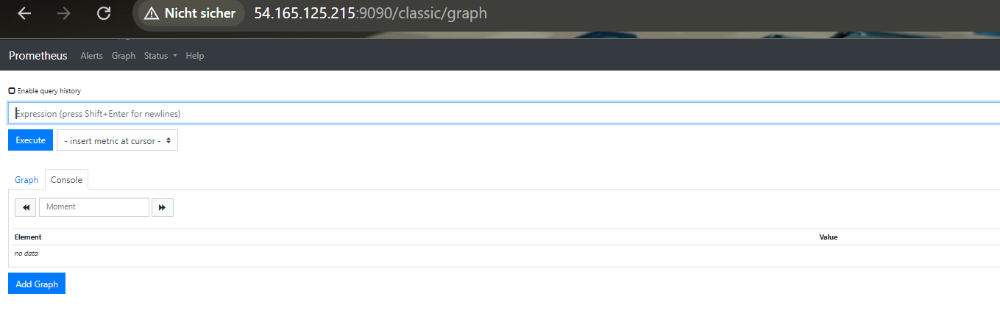
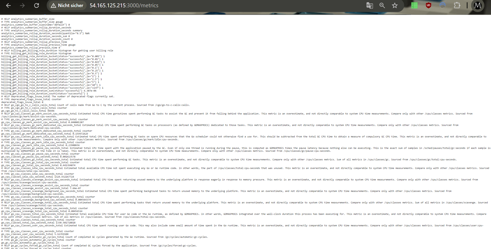

#### Block3-KN01

A:

B:

# Prometheus Kurzzusammenfassung

- Scrapes: Regelmässiges Abrufen von Metriken über Endpunkte (beispiel ist der`http://[...]/metrics` von Node Exporter oder Applikationen).
- Rules:
    - Recording Rules: Vorkalkulierte Metriken (Summe von HTTP-Anfragen).
    - Alerting Rules: Alarme bei Bedingungen (up == 0 signalisiert, dass ein System nicht erreichbar ist).
- Eigene Metriken: Anwendung instrumentieren, /metrics-Endpoint einrichten, in prometheus.yml mit job_name und targets konfigurieren und Rules in rules.yml definieren.
- Variablen: Konfigurationsvariablen wie job_name, targets (aus Prometheus Konfiguration) und Metrik-Namen wie `up`, `http_requests_total` (aus den abgefragten Endpunkten).
- Systemstatus: Der automatisch generierte up-Wert (1 = erreichbar, 0 = down) zeigt den Status des Systems.
